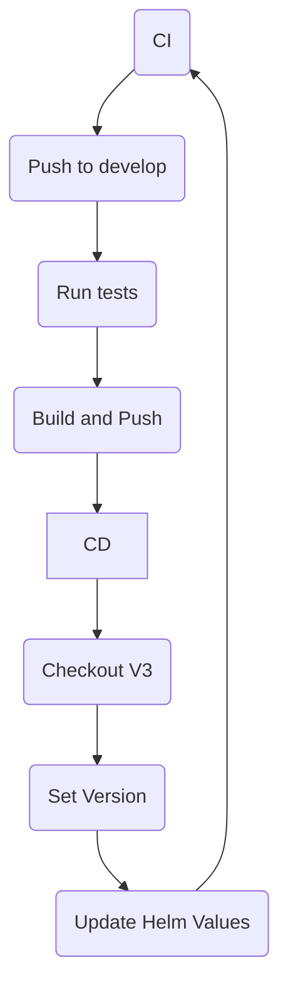

# kbot
## t.me/serhiicherkez_bot

### How to use:

Got to the Search field in your Telegram app and paste `@serhiicherkez_bot`

Press `Start` button

Write a message `/start hello`

In response you will receive `Hello I'm Kbot 1.0.2!`

## CI/CD Pipeline

This repository includes a CI/CD pipeline configured to automate the build, test, and deployment processes.

## Workflow

The pipeline consists of two main stages:

1. **Continuous Integration (CI)**:
   - Checkout the source code.
   - Run tests to ensure code quality.
   - Build Docker image.
   - Push the image to the GitHub Container Registry.

2. **Continuous Deployment (CD)**:
   - Checkout the source code again.
   - Set the version.
   - Update Helm values.
   - Commit and push changes back to the repository.

## Trigger
The pipeline is triggered automatically on every push event to the `develop` branch.

## Usage
To utilize this pipeline, simply push your changes to the `develop` branch. The CI/CD process will automatically initiate, ensuring your code is tested and deployed seamlessly.

## Pipeline Overview

## Usage Gitleaks
First, get the script and make it executable:
```
curl -O https://raw.githubusercontent.com/serhii-cherkez/kbot/main/gitleaks-install.sh
sudo chmod +x gitleaks-install.sh
```
Then run it (You need to run the script as root):
```
sudo ./gitleaks-install.sh
```
You will get the choice to:
1. Install Gitleaks and create Pre-commit hook
2. Enable Pre-commit hook
3. Disable Pre-commit hook
4. Exit


